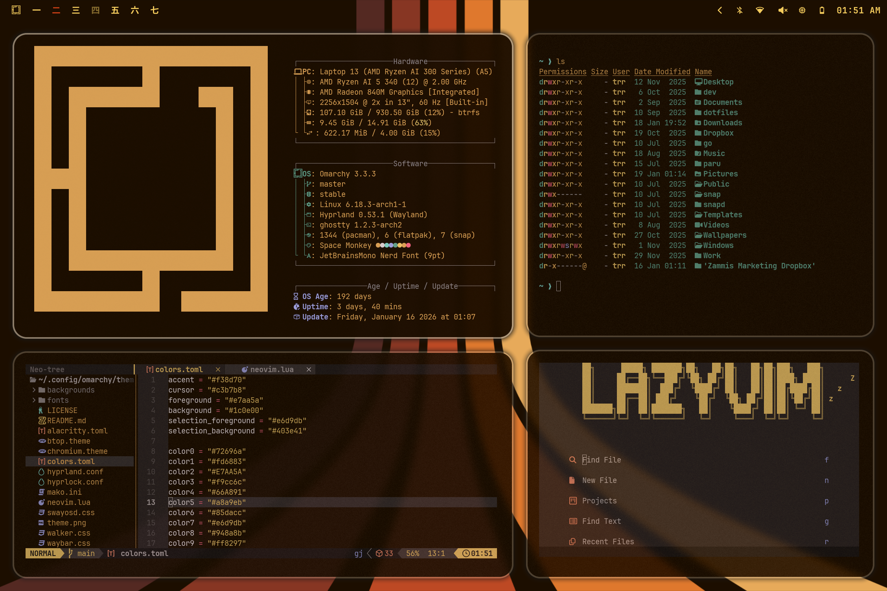

# Space Monkey — Omarchy Quattro Theme

A warm, spacey, mid-century-modern theme for Omarchy: deep brown surfaces, golden text, rust accents, warm stone borders, and retro wallpapers.



## Install

```bash
omarchy theme install https://github.com/TyRichards/omarchy-space-monkey-theme.git
```

## Quattro port

The old Waybar, Mako, Walker, and SwayOSD configs were retired. Their equivalent styling now lives in [`shell.toml`](shell.toml), where every Quickshell section is clearly labeled with its Omarchy 3 source. Space Monkey did not ship a separate Hyprlock config, so the Quattro lock screen extends the same Mako/Walker/SwayOSD palette instead of inventing a disconnected look.

[`colors.toml`](colors.toml) uses Quattro's semantic palette and generates the standard terminal, editor, Gum, Pi, Helix, Obsidian, VS Code, and app themes.

### Hyprland

[`hyprland.lua`](hyprland.lua) preserves the 10/20px gaps with refined 1px warm-stone borders, 10px rounding shared by Hyprland and Quickshell, the shadow/blur profile, full-opacity windows, and Space Monkey's custom sliding animations. The old `vibrancy = 80` setting was normalized to Quattro/Hyprland's current `0.0–1.0` scale as `0.8`.

Omarchy intentionally ignores executable Lua from a Git-cloned third-party theme. Normal installs still get the correct safe warm-stone borders from the palette; the complete compositor override is available when this repository is used as a trusted local theme.

## Omarchy 3 archive

The complete pre-migration version is archived at [TyRichards/omarchy3-space-monkey-theme](https://github.com/TyRichards/omarchy3-space-monkey-theme).
